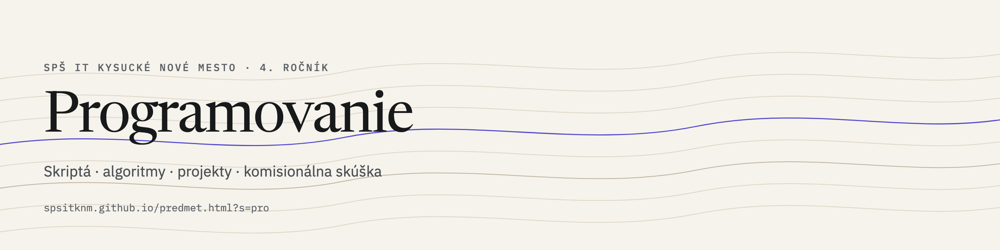
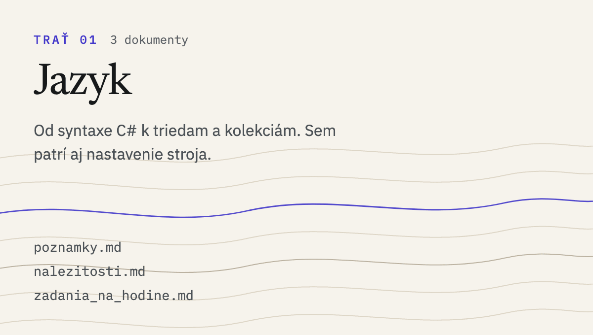
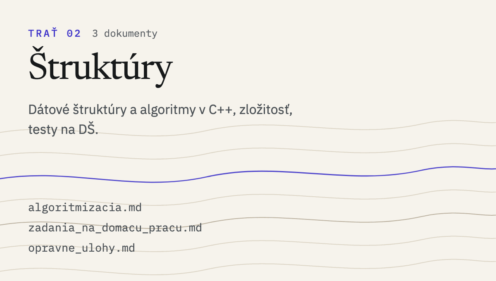
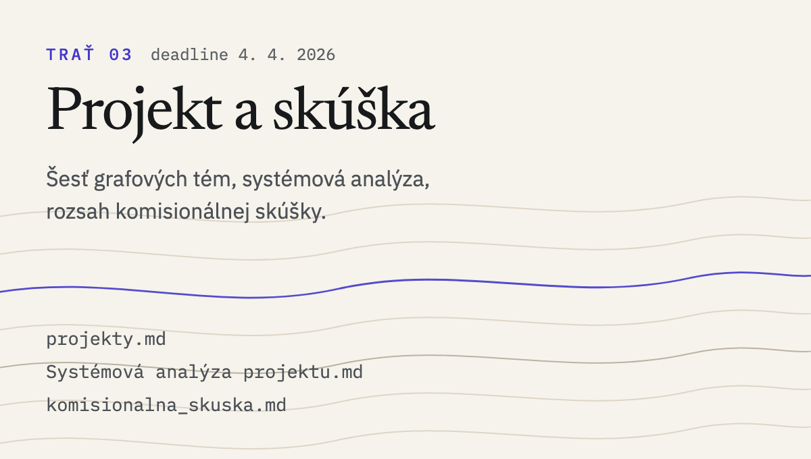

  <picture>
    <source media="(prefers-color-scheme: dark)"  srcset="assets/banner-pro-dark.png">
    <source media="(prefers-color-scheme: light)" srcset="assets/banner-pro-light.png">
    
  </picture>

Repozitár predmetu **PRO** na SPŠ IT Kysucké Nové Mesto (4. ročník). Skriptá, zadania a projekty ako Markdown — **web ich renderuje priamo**, surové `.md` čítať netreba.

**[→ Otvoriť predmet na webe](https://spsitknm.github.io/predmet.html?s=pro)** · [čítačka](https://spsitknm.github.io/citacka.html?s=pro&doc=poznamky) · [hub](https://spsitknm.github.io) · [Discord](https://discord.gg/eSQDsna4d7)

## Ako to na sebe stojí

<table>
<tr>
<td width="33%"><a href="https://spsitknm.github.io/citacka.html?s=pro&doc=poznamky"><picture><source media="(prefers-color-scheme: dark)" srcset="assets/card-pro-1-dark.png"><source media="(prefers-color-scheme: light)" srcset="assets/card-pro-1-light.png"></picture></a></td>
<td width="33%"><a href="https://spsitknm.github.io/citacka.html?s=pro&doc=algoritmizacia"><picture><source media="(prefers-color-scheme: dark)" srcset="assets/card-pro-2-dark.png"><source media="(prefers-color-scheme: light)" srcset="assets/card-pro-2-light.png"></picture></a></td>
<td width="33%"><a href="https://spsitknm.github.io/citacka.html?s=pro&doc=projekty"><picture><source media="(prefers-color-scheme: dark)" srcset="assets/card-pro-3-dark.png"><source media="(prefers-color-scheme: light)" srcset="assets/card-pro-3-light.png"></picture></a></td>
</tr>
</table>

Karty vedú priamo do čítačky. Poradie trate = poradie, v akom to preberáme.

## Všetky materiály

- `poznamky.md` — C# od základov: syntax, typy, premenné, pretečenie, konvencie
- `algoritmizacia.md` — dátové štruktúry a algoritmy v C++, zložitosť
- `komisionalna_skuska.md` — rozsah a hodnotenie komisionálnej skúšky
- `projekty.md` — šesť grafových a optimalizačných zadaní + deadline
- `zadania_na_domacu_pracu.md` — testy na dátové štruktúry (LL, Stack/Queue, BST, Hash, Graf)

Zobraziť zvyšných 9 materiálov

- `opravne_ulohy.md` — úlohy na opravu známky
- `zadania_na_hodine.md` — AI Workshop, pracovný list ku Claude Code
- `Súťaž.md` — tímová súťaž v angličtine, formát Advent of Code
- `Systémová analýza projektu.md` — šablóna projektovej dokumentácie (FURPS, UML)
- `nalezitosti.md` — nastavenie .NET, VS Code, C#
- `Linux Commands Cheat Sheet.md` — referencia
- `GitHub_vs_GitLab.md` — referencia
- `Makefile.md` — referencia
- `aktuality.md` — aktuálne oznamy (zobrazujú sa na hube)

## Ako sa tu pracuje

**Zadania** sa odovzdávajú ako Issue z pripravenej šablóny.
**Projekt** potrebuje systémovú analýzu podľa šablóny (FURPS + UML).
**Obsah** je Markdown v tomto repe; zmena sa hneď objaví na webe.
**Zoznamy a čas čítania** na webe pochádzajú z [`content/pro.json`](https://github.com/SPSITKNM/SPSITKNM.github.io/blob/main/content/pro.json) v hub repozitári — nie sú napevno.

---

> *Non scholae, sed vitae discimus.*

Tomáš Mucha · SPŠ IT Kysucké Nové Mesto · 2025/2026
